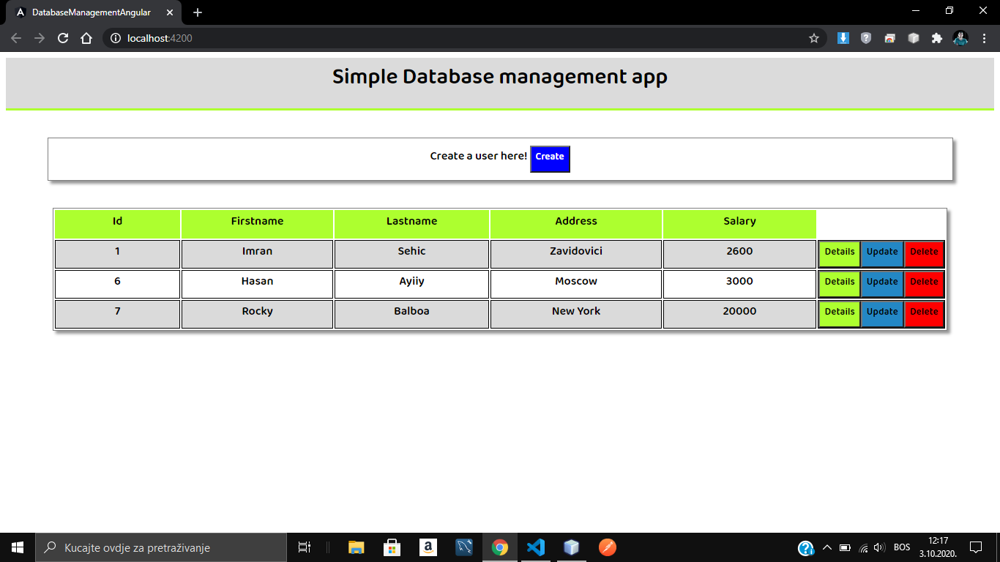
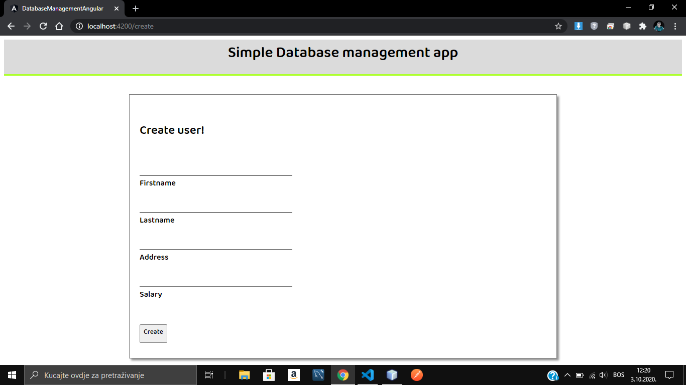
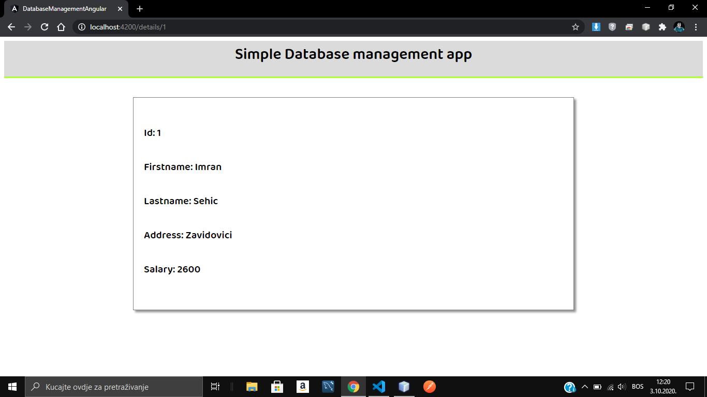
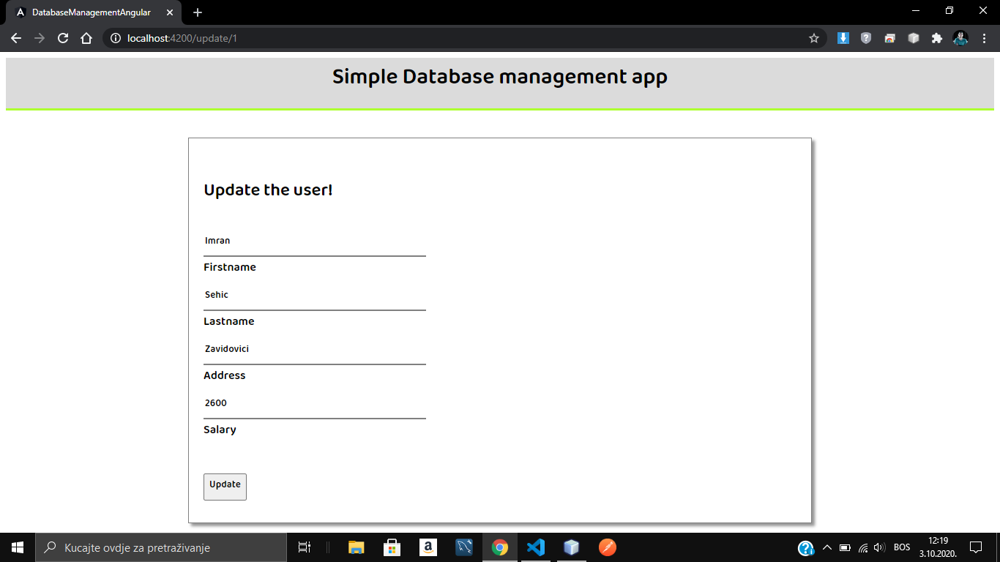

# Database-App-Spring-Boot
<h3>This is the backend of a simple dabatabase management application written in Spring Boot with Java.</h3>  
The application is capable of doing basic CRUD operations. There are 5 api endpoints among which get all users, get user by id, insert user, update user and delete user. 
And here is the link to the frontend code - <a href="https://github.com/Imran-Sehic/database-app-angular">Click here</a>  
Below are some of the screenshots of the application itself.

## 1.List users

 

## 2.Create user

 

## 3.User details

 

## 4.Update user

 
